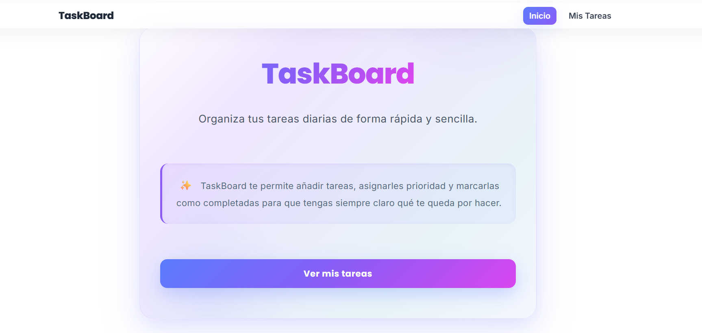
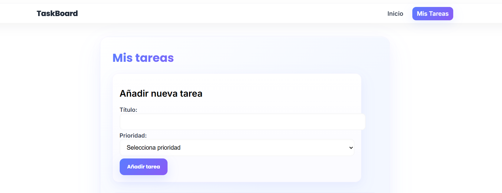
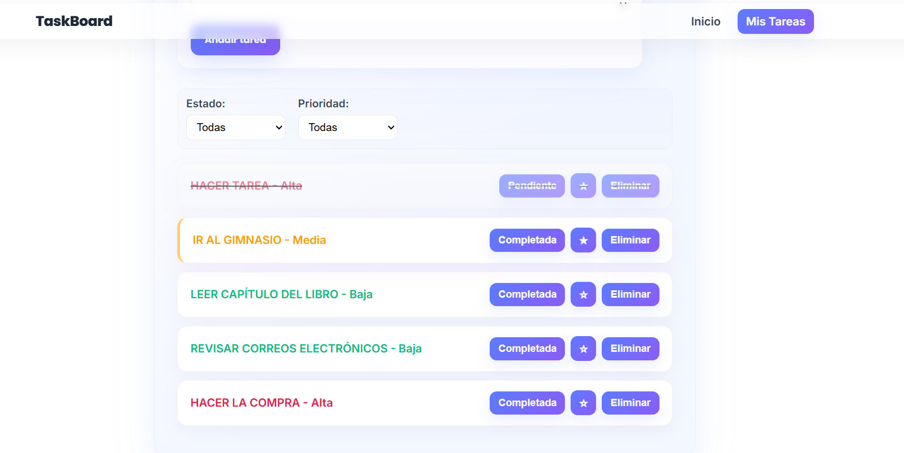
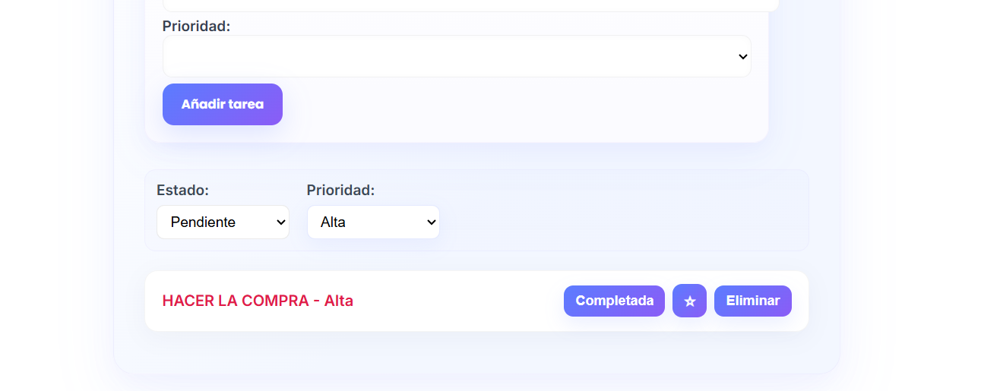

# Taskboard

## Descripción breve

Taskboard es una aplicación de gestión de tareas que permite a los usuarios crear, completar, marcar como favoritas y eliminar tareas. Incluye filtrado por estado (completadas/pendientes) y prioridad (alta/media/baja).

## Instrucciones para ejecutarla

### Requisitos previos
* Node.js
* Angular CLI

### Instalación y ejecución

1. Clonar el repositorio:

git clone https://github.com/soniak05/taskboard-angular.git

2. Instalar dependencias:

npm install

3. Ejecutar la app:

ng serve

4. Abrir en el navegador:

http://localhost:4200

## Capturas de pantalla

Pantalla de inicio de TaskBoard:  

Formulario para añadir una tarea:  

Lista de tareas mostrando tareas completadas y favoritas:  

Tareas filtradas por estado y prioridad:  

## Notas importantes

* La aplicación utiliza **standalone components** de Angular 21
* El filtrado de tareas se realiza con un **custom pipe** llamado PriorityFilterPipe